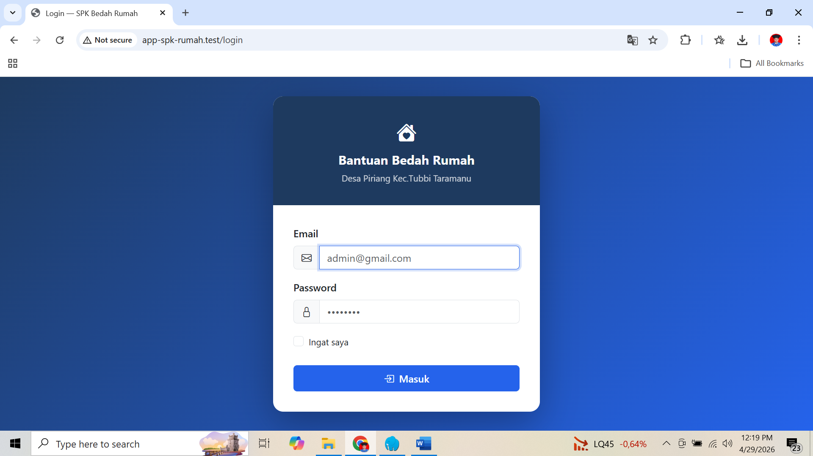
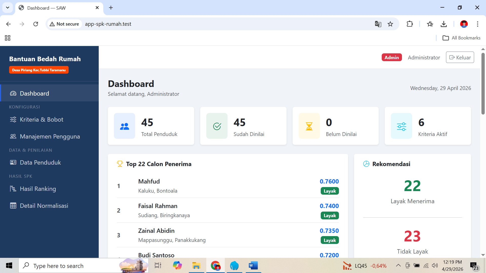
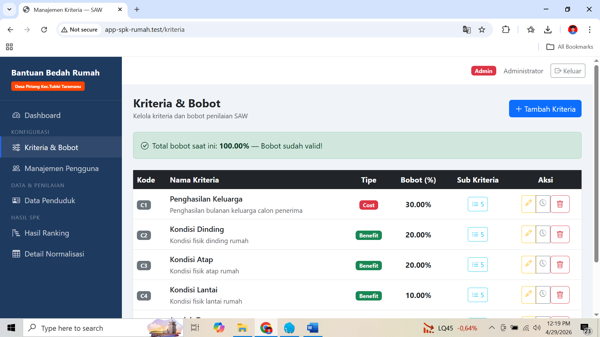
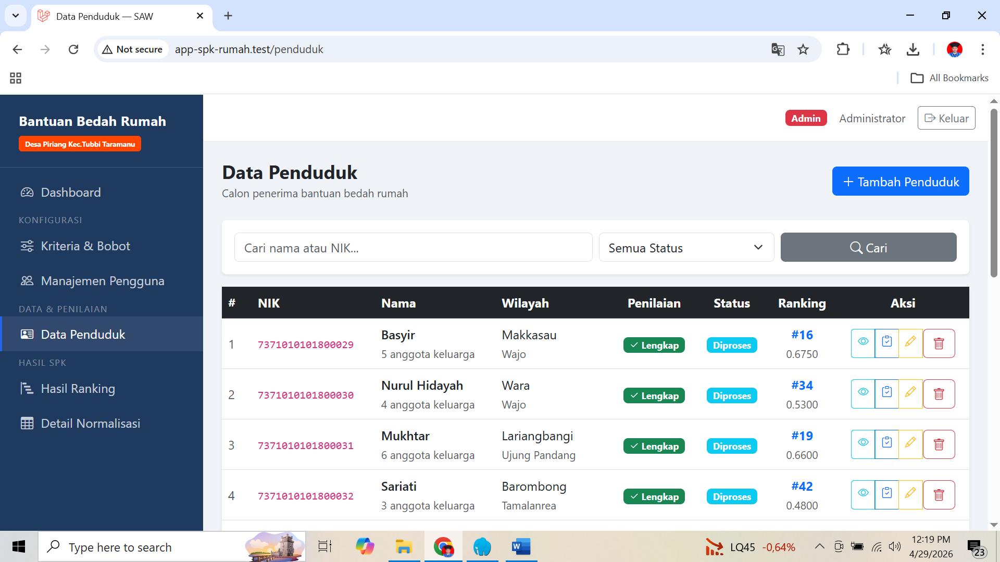
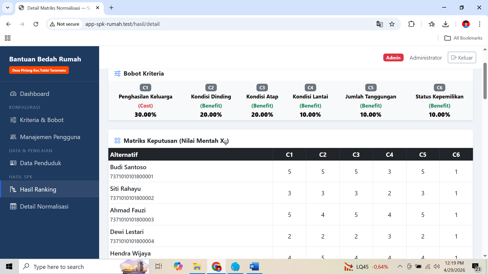
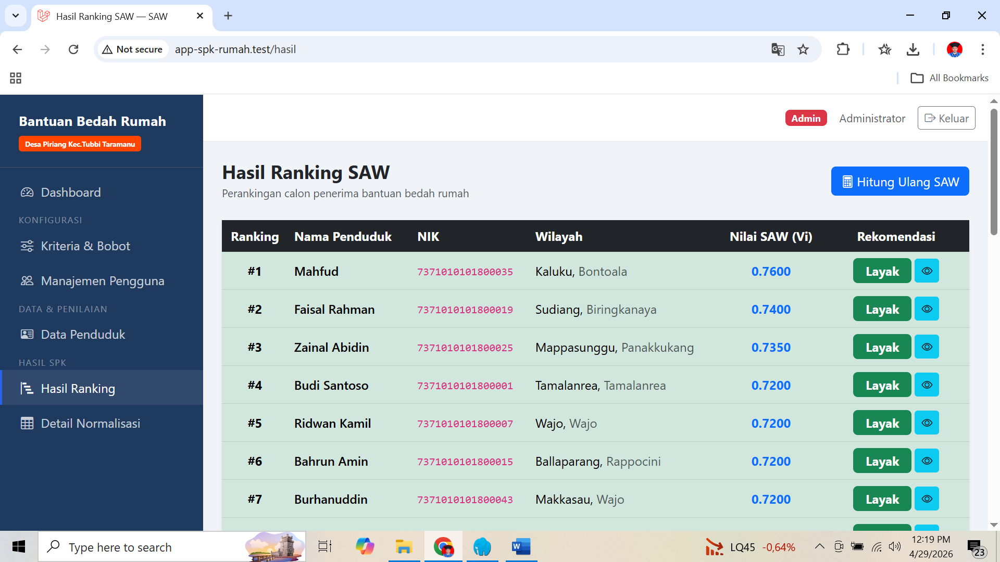

# 🏠 Sistem Pendukung Keputusan (SPK) - Bedah Rumah

<p align="center">
  
  
  
  
</p>

Aplikasi **Sistem Pendukung Keputusan (SPK) Penentuan Penerima Bantuan Bedah Rumah** adalah platform digital yang dirancang untuk membantu instansi atau pemerintah desa dalam menyeleksi warga yang berhak menerima bantuan renovasi rumah. 

Aplikasi ini menggunakan metode **Simple Additive Weighting (SAW)** untuk memastikan penilaian dilakukan secara objektif, matematis, dan terukur, sehingga bantuan dapat disalurkan tepat sasaran.

---

## ✨ Fitur Utama

- **Manajemen Data Penduduk:** Pencatatan data lengkap calon penerima bantuan beserta dokumentasi foto kondisi rumah.
- **Manajemen Kriteria & Bobot:** Admin dapat dengan mudah menambah, mengubah, dan menentukan bobot setiap kriteria (Benefit/Cost).
- **Perhitungan Otomatis (Metode SAW):** Sistem akan menormalisasi data dan menghitung skor akhir secara otomatis dan real-time.
- **Rekomendasi Cerdas:** Memberikan label otomatis (Layak/Tidak Layak) berdasarkan ambang batas (*threshold*) skor yang telah ditentukan.
- **Alur Persetujuan (Approval Workflow):** Mendukung perubahan status secara bertahap mulai dari *Menunggu*, *Diproses*, hingga *Diterima* atau *Ditolak*.
- **Laporan & Ekspor:** Menghasilkan ranking prioritas yang dapat dieksplor dan dicetak untuk keperluan rapat keputusan.
- **Multi-Role Access:** Dilengkapi dengan hak akses pengguna yang berbeda-beda (Admin, Evaluator, Pimpinan).

---

## 📸 Tangkapan Layar (Screenshots)

Berikut adalah beberapa tampilan dari aplikasi SPK Bedah Rumah:

| Halaman Login | Halaman Dashboard |
| :---: | :---: |
|  |  |

| Data Kriteria | Data Penduduk |
| :---: | :---: |
|  |  |

| Proses Normalisasi | Hasil / Ranking |
| :---: | :---: |
|  |  |

---

## 🧐 Memahami Metode SAW

Metode **Simple Additive Weighting (SAW)** adalah algoritma yang mencari penjumlahan terbobot dari rating kinerja setiap alternatif pada semua kriteria.

### 1. Tipe Kriteria
Setiap kriteria diklasifikasikan menjadi dua jenis:
*   **Benefit (Semakin Besar Semakin Baik):** Jika nilai tinggi, alternatif lebih direkomendasikan.
    *   *Rumus:* `Nilai Warga / Nilai Tertinggi (Max)`
    *   *Contoh:* Jumlah tanggungan keluarga, kondisi kerusakan rumah.
*   **Cost (Semakin Kecil Semakin Baik):** Jika nilai rendah, alternatif lebih direkomendasikan.
    *   *Rumus:* `Nilai Terendah (Min) / Nilai Warga`
    *   *Contoh:* Penghasilan per bulan.

### 2. Alur Algoritma
1.  **Input Matriks Keputusan:** Mengumpulkan data mentah (nilai kriteria) dari setiap penduduk.
2.  **Normalisasi Matriks:** Menyesuaikan skala semua nilai kriteria menjadi **0 - 1** menggunakan rumus Benefit/Cost.
3.  **Perhitungan Preferensi (Skor Akhir):** Mengalikan matriks ternormalisasi dengan bobot masing-masing kriteria.
4.  **Perangkingan:** Mengurutkan skor dari yang tertinggi (prioritas utama) ke terendah.

---

## 📊 Simulasi Perhitungan (Contoh: "Aslam")

Berikut adalah contoh perhitungan jika sistem memiliki 5 kriteria:

| Kriteria | Tipe | Bobot | Nilai Aslam | Max/Min Seluruh Data | Normalisasi | Skor (Normalisasi × Bobot) |
| :--- | :--- | :--- | :--- | :--- | :--- | :--- |
| **Penghasilan** | Cost | 30% (0.3) | 3 | Min = 1 | 1 / 3 = **0.33** | 0.33 × 0.3 = **0.10** |
| **Kondisi Dinding** | Benefit | 20% (0.2) | 4 | Max = 5 | 4 / 5 = **0.80** | 0.80 × 0.2 = **0.16** |
| **Kondisi Atap** | Benefit | 20% (0.2) | 5 | Max = 5 | 5 / 5 = **1.00** | 1.00 × 0.2 = **0.20** |
| **Jml Tanggungan**| Benefit | 15% (0.15)| 3 | Max = 5 | 3 / 5 = **0.60** | 0.60 × 0.15 = **0.09** |
| **Kepemilikan** | Benefit | 15% (0.15)| 3 | Max = 5 | 3 / 5 = **0.60** | 0.60 × 0.15 = **0.09** |

**Total Skor Akhir Aslam:** `0.10 + 0.16 + 0.20 + 0.09 + 0.09 = 0.64` 
*(Jika batas kelayakan sistem adalah `0.5`, maka Aslam direkomendasikan **Layak**)*

---

## 👥 Hak Akses Pengguna (Roles)

| Role | Deskripsi Tugas |
| :--- | :--- |
| **Admin** | Memiliki akses penuh. Mengelola master data kriteria, bobot, user, memvalidasi data dan dapat menetapkan keputusan final. |
| **Evaluator / Surveyor** | Bertugas ke lapangan. Menginput data penduduk, mengunggah foto survei, dan memberikan nilai pada form kriteria. |
| **Pimpinan** | Memantau dashboard, melihat laporan hasil perangkingan, mengunduh file laporan, dan memberikan ACC (Persetujuan Akhir). |

---

## 🚀 Panduan Instalasi & Menjalankan Aplikasi

Aplikasi ini dibangun menggunakan framework **Laravel**. Ikuti langkah-langkah berikut untuk menjalankannya di komputer lokal Anda (Localhost).

### Persyaratan Sistem
*   PHP >= 8.2
*   Composer
*   Node.js & NPM
*   Database (MySQL / MariaDB)

### Langkah Instalasi

1. **Clone Repositori & Masuk ke Direktori**
   ```bash
   git clone <url-repo-anda> app-spk-rumah
   cd app-spk-rumah
   ```

2. **Install Dependensi PHP & JavaScript**
   ```bash
   composer install
   npm install
   ```

3. **Konfigurasi Environment**
   *   Salin file `.env.example` menjadi `.env`.
   ```bash
   cp .env.example .env
   ```
   *   Generate application key:
   ```bash
   php artisan key:generate
   ```
   *   Buka file `.env` dan atur koneksi database Anda:
   ```env
   DB_CONNECTION=mysql
   DB_HOST=127.0.0.1
   DB_PORT=3306
   DB_DATABASE=db_spk_rumah
   DB_USERNAME=root
   DB_PASSWORD=
   ```

4. **Migrasi Database & Seeder**
   *   Jalankan perintah ini untuk membuat struktur tabel dan mengisi data awal (seperti akun default, dummy data kriteria, dll).
   ```bash
   php artisan migrate --seed
   ```

5. **Link Storage (Sangat Penting)**
   *   Agar gambar survei rumah yang diunggah dapat diakses dan ditampilkan di aplikasi:
   ```bash
   php artisan storage:link
   ```

6. **Jalankan Server Lokal**
   *   Jalankan Vite untuk proses *build asset* CSS/JS (buka terminal baru):
   ```bash
   npm run dev
   ```
   *   Jalankan development server Laravel:
   ```bash
   php artisan serve
   ```
   *   Akses aplikasi di web browser melalui URL: `http://localhost:8000`

---

## 📁 Struktur Direktori Penting Terkait SPK

Jika Anda ingin menyesuaikan logika bisnis aplikasi ini, berikut adalah lokasi file-file krusial:

*   **Logika Algoritma SAW:** `app/Services/SawService.php` *(Semua kalkulasi normalisasi & skor berada di sini)*
*   **Controller Ranking/Hasil:** `app/Http/Controllers/HasilController.php` *(Menangani tampilan tabel hasil SAW)*
*   **View Detail Penduduk:** `resources/views/penduduk/show.blade.php` *(Halaman detail data warga beserta panel persetujuan/approval)*
*   **Skema Database:** `database/migrations/` *(Definisi arsitektur tabel untuk kriteria, alternatif/penduduk, dan penilaian)*

---
*Dibuat dengan ❤️ untuk membantu terwujudnya keadilan sosial melalui teknologi.*
